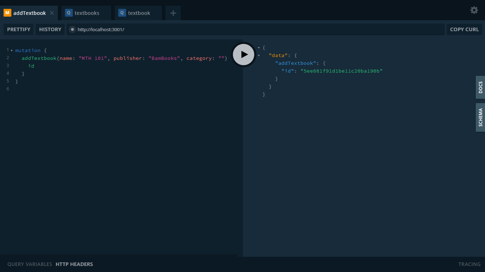
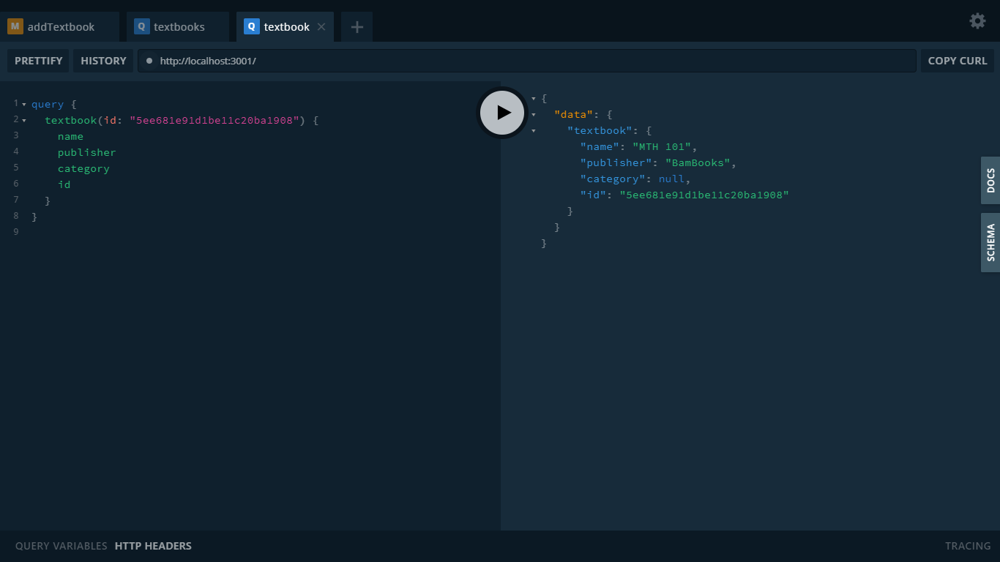
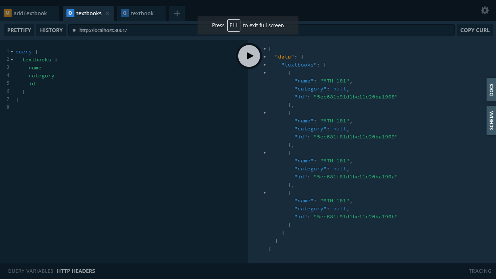

# Day 14: GraphqlQL server with MongoDB
A graphql server with a mongodb database 

## Screenshot of add single textbook mutation

## Screenshot of single textbook query

## Screenshot of multi textbook query
