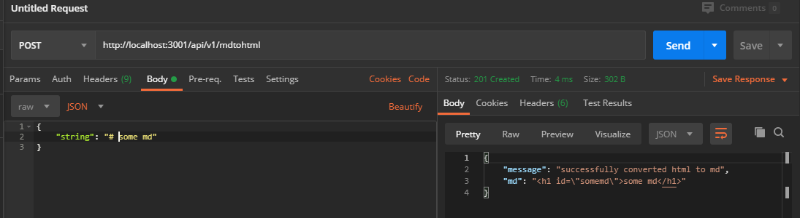
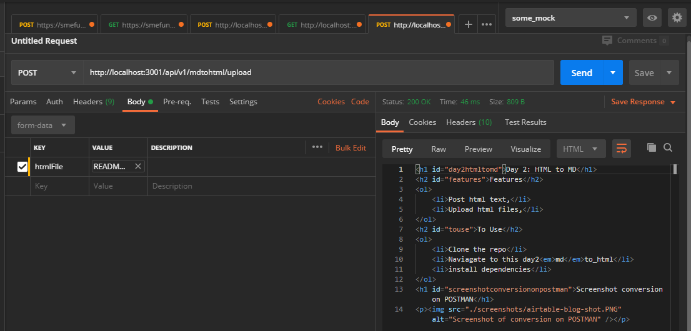

# Day 2: HTML to MD

## Features

1. Post html text,
2. Upload html files,

## Dependencies
1. `express-fileupload` for file uploads
2. `showdown` for md to html conversion
3. `express` for server logic

## To Use do the following

1. Clone the repo
2. Naviagate to this day2_md_to_html
3. install dependencies

# Screenshot of conversion on POSTMAN

# Screenshot of upload conversion on POSTMAN

