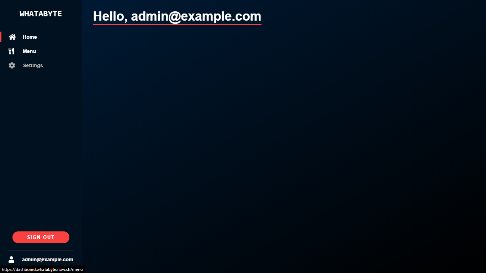
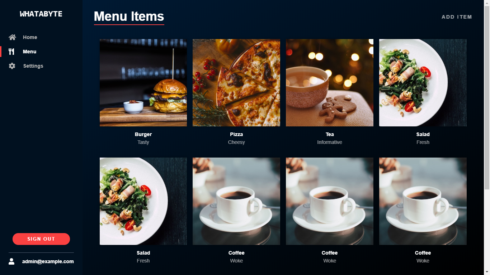

# Day 15: Nestjs API with postgres

A Nestjs API with Auth0 integration

## Features

1. Add new items to DB (Admins)
2. View items (all users)

## Dependencies

1. `nestjs` for APIs
1. `pg-promise` for DB service
2. `Auth0 and friends` for authentication 

## To Use do the following

1. Clone the repo
2. Naviagate to this day15_nestjs_api_with_postgres
3. install dependencies
6. Play around as you wish

## Screenshots of interfacing frontend
### Home page

### Menu page
