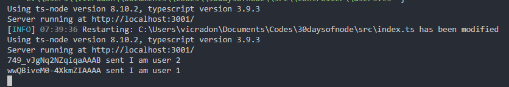

# Day 6: Chat rooms and DMs 

PS: This API would be used from day 4 to day 10.

An API with messaging features built using TypeScript and Express. We can send messages to individuals and groups. DB is a Postgresql DB

## Features

1. Send message to individual users
2. Send messages to chat rooms

## Dependencies

1. `socket.io` for messaging service
1. `postgresql pg javascript driver` for DB service
2. `express` for server logic

## To Use do the following

1. Clone the repo
2. Naviagate to this day3_twillo_whatsapp_api
3. install dependencies
6. Play around as you wish

# Screenshot of different users sending messages

