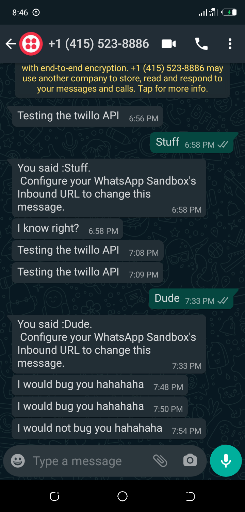

# Day 3: Twillo-WhatsApp API

## Features

1. Send messages to people

## Dependencies

1. `twillo` for messaging service
2. `express` for server logic

## To Use do the following

1. Clone the repo
2. Naviagate to this day3_twillo_whatsapp_api
3. install dependencies
4. Login or register a twillo account: https://twillo.com/login
5. Copy the accountSid and authToken and twillo number and paste in your .env file
7. Play around as you wish

# Screenshot of twillo whatsapp client

