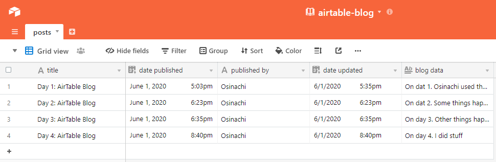

# Day 1: Airtable Blog API

Airtable serves as the DB for this project
The Airtable API is used to perform

1. Posting,
2. Editing,
3. Deleting,
4. Reading of blog posts

## To Use

1. Clone the repo
2. Naviagate to this day1_airtable_blog
3. install dependencies
4. Use the env.example to generate your own env file
5. Perform your CRUD functionality

# Screen of airtable base
