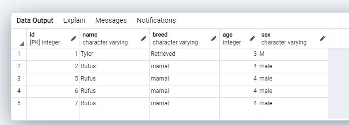

# Day 14: DB methods with pg-promise

A puppies API for performing some CRUD operations on a puppies DB

## Features

1. Perform CRUD database operations on the DB

## Dependencies

1. `postgresql pg-promise javascript driver` for DB service
2. `express` for server logic

## To Use do the following

1. Clone the repo
2. Naviagate to branch day14_db_methods_with_pg-promise
3. install dependencies
4. Generate an .env file by running

   ```bash
   cp .env.example .env
   ```

5. Put in the required environmental variables
6. run

   ```bash
   npm run init
   ```

7. run

   ```bash
   npm run dev
   ```

8. Play around as you wish

# Screenshot of pg Admin all query


